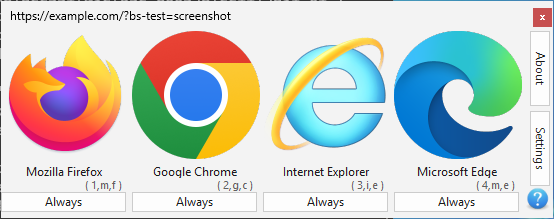
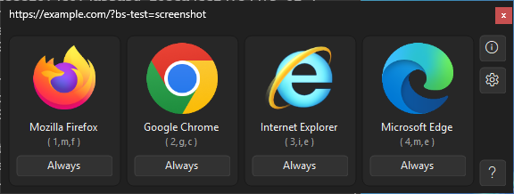
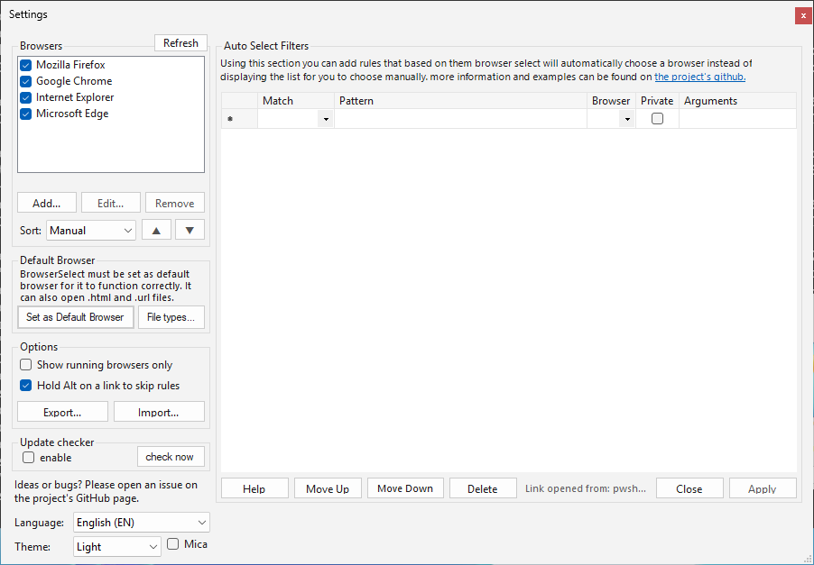
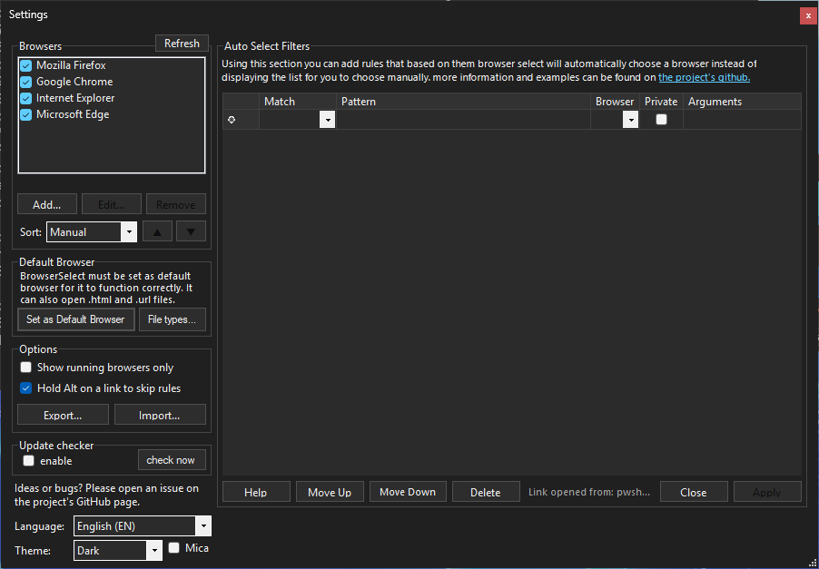

# Browser Select

Browser Select is a utility to dynamically select the browser you want instead of just having one default for all links. Similar to the prompt in android to choose a browser when a link in a non-browser app is clicked/touched. It may not be useful for everyone but it helps when you use multiple browsers for different things (e.g. one with proxy and one without) and open many links from other applications (e.g. Messengers).

This is an actively maintained fork of [zumoshi/BrowserSelect](https://github.com/zumoshi/BrowserSelect) with Windows **64-bit** installer builds via GitHub Actions, maintained by [snipeTR](https://github.com/snipeTR). Available in English and Turkish (Settings → Language).

Instead of having to copy the link, open the desired (non-default) browser then pasting the link, all you need to do is to click on the link and this prompt will open allowing you to choose the browser you want. It automatically detects installed browsers. It does not require administrative rights and can be installed as a restricted user.

You may click on the desired browser or press one of the shortcuts (its index or the first letter of its name), for example for chrome you can press 2, g or c.
you may also press Esc (or click the X) to not open the URL.

**Full-screen windows and several monitors:** a browser opens a new link in the window you used last, which may be a full-screen video on your second monitor. With *Settings → Options → Avoid full-screen windows* (on by default) BrowserSelect brings the browser's most recently used window that is **not** full screen to the front just before opening the link, so the video is not interrupted. If all of the browser's windows are full screen, *If all windows are full screen* decides: **Window on primary monitor** (default) or **Last used window** (the browser decides). Maximized windows are not full screen; private windows, new-window arguments and a browser that is not running are left alone. Works the same with one monitor.

To install, download the installer below then set BrowserSelect as the default browser.

Settings (Set as Default Browser, browser list, auto select rules, language and theme):

| Light | Dark |
|---|---|
|  |  |

Screenshots: Windows Server 2025 GitHub Actions runner at 100 % scale (Actions → UI screenshots (manual) takes every window at 100–200 %).

BrowserSelect has been tested on windows 7, windows 8.1 and windows 10/11. Requires **.NET Framework 4.8**.

# Download

Windows 64-bit installer: download `BrowserSelect-<version>-x64-Setup.exe` from the [latest release](https://github.com/snipeTR/BrowserSelect/releases/latest) (requires Windows 10/11 x64 with .NET Framework 4.8).

Latest release: [github.com/snipeTR/BrowserSelect/releases/latest](https://github.com/snipeTR/BrowserSelect/releases/latest)

CI builds (MSBuild + NSIS) run on GitHub Actions on every push to `master`. When the version in `BrowserSelect/Properties/AssemblyInfo.cs` changes, a draft release with the installer is created automatically (no manual run needed); published releases are available on the Releases page.

# Code signing policy

Release installers are intended to be signed through the SignPath Foundation free code signing program for open source projects. See the [Code signing policy](docs/code-signing-policy.md) for what is signed, team roles and the privacy policy (BrowserSelect only connects to GitHub when update checking is enabled or the user requests an update).

# Related links

[AlternativeTo](http://alternativeto.net/software/browser-select/)

Reviews: [DSTech](http://dipendrashekhawat.com/choose-specific-browser-every-time-you-open-a-link/)
[TrishTech](http://www.trishtech.com/2016/07/use-different-browsers-for-different-links-with-browserselect/)
[DonationCoder](http://www.donationcoder.com/forum/index.php?topic=42860.msg401447)

Upstream / mirrors (may be outdated):
[zumoshi/BrowserSelect](https://github.com/zumoshi/BrowserSelect/releases)
[SoftPedia](http://www.softpedia.com/get/Internet/Browsers/Browser-Select.shtml)

# ToDo

Just a list of some ideas that can be integrated into BrowserSelect.
- [x] Make Settings persist across updates
- [x] Shift-Click to open link in incognito/private mode
- [x] Option to display running browsers only
- [x] More Auto-Select rule options
    - [x] based on the source application
    - [x] based on file extension
    - [x] based on URL path
    - [x] based on keywords
    - [x] ignoring the URL as an option
    - [x] custom flags to browsers as an option (e.g. incognito mode or disable CSRF)
- [x] export/import for rules/settings
- [x] Sorting browsers on the list
- [x] Custom Shortcuts
- [x] Ignoring the rules if Alt key is held down when clicking a link
- [ ] an API to invoke BrowserSelect
- [x] Bugfix for when Browser was launched with Maximize window state (browser select will launch maximized)
- [ ] A browser extension to launch the correct browser based on the rules even if a link is clicked inside a browser
- [x] support for portable browsers (adding browsers using a browse button rather than registry)
- [ ] support for non-browser apps as an option (e.g. download managers)
- [x] themes ? or at least an optional transparent Aero glass mode (Windows 10/11 look: Light / Dark / Follow Windows, Windows 11 rounded corners and optional Mica)
- [x] Ability to choose custom icons for browsers
- [ ] display the unshortened version of adf.ly or goo.gl links when selecting the browser
- [x] Localization (English and Turkish; texts in `BrowserSelect/Localization/Strings*.resx`, language selection in Settings)
- [ ] handling of other link types (e.g. `mail:` in case you have both outlook and thunderbird installed [or maybe as a sister app])
- [x] update checker (not as a popup or messagebox, a tiny icon somewhere on the main form that appears when you don't have the last version)
- [x] add file associations (e.g. .url files, or .html files)

# Changelog

v1.5.3.0
- **Avoid full-screen windows** (Settings → Options, on by default; based on the original "focus the window on the first monitor" idea by Cihan Uygun): before a link is handed to a running browser, BrowserSelect brings the browser's most recently used (top of the Z-order) visible window that is not full screen to the front, so the browser opens the link there instead of in a full-screen video on another monitor. A minimized window is only used (and restored) if there is no other. Replaces the old always-on behaviour that focused the window on the leftmost/topmost monitor
- **If all windows are full screen:** drop-down below it: *Window on primary monitor* (default; the browser window on Windows' main display) or *Last used window* (nothing is changed, the browser decides). With the check box off BrowserSelect never changes the focus
- Full screen = the window's visible bounds (DWM extended frame bounds) cover the whole monitor including the taskbar area **and** the window has no title bar (`WS_CAPTION`), so maximized windows (also with an auto-hidden taskbar) are not full screen. Tool windows, owned/popup windows, cloaked windows (other virtual desktops), untitled and zero-size windows are ignored
- Skipped when the link opens in a private window, when the browser's or the rule's arguments open a new window (`--new-window`, `--incognito`, `-private-window`, `--app=...`, `--kiosk`, ...), when the browser is not running, for legacy (UWP) Edge and Internet Explorer, and for *ignore URL* rules
- Both settings are saved like the others and included in settings Export/Import (`avoidFullscreen`, `fullscreenFallback`)
- Settings → Options group is taller (new check box, label and drop-down); the window is 64 px (at 100 %) taller, the rest of the layout is unchanged
- Help (**?**, Settings → Help) and `help/filters*.md` updated in English and Turkish
- Human test recipe incl. multi-monitor scenarios: [Tests/human_test/17-tam-ekran-pencere.md](Tests/human_test/17-tam-ekran-pencere.md); verified manually on real multi-monitor hardware

v1.5.2.0
Windows 10/11 look (appearance only: window sizes, control positions, features and behaviour are unchanged). Earlier 1.5.0.0/1.5.1.0 builds were internal test builds and were not released.
- New application manifest: Common Controls 6 (themed controls and message boxes), Windows 7–11 compatibility and *system DPI awareness*: text is sharp at the display scale you signed in with; on a second monitor with another scale Windows stretches the window to the correct size
- Segoe UI 9pt everywhere; every window keeps its size and control positions. Fixed-size buttons/labels whose (translated) text would not fit fall back to a smaller or the original font, and are fitted again once the window has its final scaled size
- Flat buttons with a thin border and a subtle hover/pressed color (short buttons such as Refresh and Always draw their text themselves so it is not clipped); Windows 11 light colors; rule grid with flat headers, light grid lines and soft selection color; thin separators and group box frames
- **Theme** drop-down at the bottom left of Settings (below Language): Light (default), Dark (dark title bar, windows, lists, grid, menus and scroll bars) or Follow Windows (uses the Windows app mode). Applied immediately, included in settings export/import
- Windows 11: rounded window corners; optional **Mica** effect on the title bar (Settings → Mica, Windows 11 22H2+, no effect on Windows 10). On older Windows every step fails silently and keeps the classic look
- High display scales: tested at 100 %, 125 %, 150 %, 175 % and 200 % (every window in Light/Dark and English/Turkish). Windows bigger than the screen (Settings and About at 175 %/200 %) get scroll bars instead of hiding the bottom buttons below the taskbar; the help window's Close button stays below the text
- Shorter feedback text in Settings ("Ideas or bugs? Please open an issue on the project's GitHub page.")
- Help (**?**) updated in English and Turkish (Theme, Mica, display scale behaviour); new texts in `Strings.resx` / `Strings.tr.resx`
- All appearance code in one place: `BrowserSelect/UI/Theme.cs` (plus `UI/LayoutCheck.cs` for the clipping/fit checks)
- README screenshots replaced with the new look (`screenshots/picker-*.png`, `screenshots/settings-*.png`)
- Manual GitHub Actions workflow **UI screenshots (manual)** (`.github/workflows/ui-screenshots.yml`, Actions → Run workflow): builds the app and uploads screenshots of all windows at 100–200 % scale with a layout report as an artifact (never creates a release)
- Human test recipe: [Tests/human_test/16-gorunum-tema.md](Tests/human_test/16-gorunum-tema.md) (16A–16E)

v1.4.6.0
- Updater: after the "update available" message BrowserSelect asks whether to download and run the new version. On *Yes* it finds the `BrowserSelect-<version>-x64-Setup.exe` asset of the latest published release via the GitHub API, downloads it to `%TEMP%` (progress window, can be cancelled) and starts the setup. Errors (no network, no installer in the release, incomplete file) show a message and offer to open the releases page instead
- Installer and uninstaller: if BrowserSelect is running (for the current user) they ask for permission to close it; *Yes* closes it (normally first, forced if needed), *No* shows "Please close the program and restart the setup" and quits. Silent mode (`/S`) closes it without asking
- Installer is now available in English and Turkish (chosen automatically from the Windows display language)
- All new texts in English and Turkish; GitHub Actions smoke-tests the installer's close-the-running-program flow on every build
- Human test recipe: [Tests/human_test/15-guncelleme-indir-kur.md](Tests/human_test/15-guncelleme-indir-kur.md)

v1.4.5.0
- Settings → Auto Select Filters: the help link above the rule list opens this fork's rule documentation ([help/filters.md](help/filters.md)); with the Turkish UI it opens the Turkish page ([help/filters.tr.md](help/filters.tr.md))
- `help/filters.md` rewritten for the new rule types (match types, Private, Arguments, ignore URL, priority order, Delete/Apply, Export/Import) and translated to Turkish
- About: the window now shows the fork maintainer snipeTR first; the original project's credits (Bor691, e-mail, zumoshi/BrowserSelect link and Bor691's bitcoin address) moved behind the new **Original project info...** button
- The two help windows (the **?** button of the browser list and **Help** in Settings) were updated for the new features, translated to Turkish and made scrollable
- "Always" button, "Open in Private Window" menu and the rule validation messages are translated too

v1.4.4.0
- Update checker now looks at this fork's published releases (`https://github.com/snipeTR/BrowserSelect/releases/latest`) instead of upstream zumoshi/BrowserSelect
- Versions are read from release tags like `v1.4.4.0-build.N` and compared numerically, so an update is only reported when the published release is newer than the installed version
- The "update available" message shows the link to the releases page

v1.4.3.0
- Turkish translation (`Strings.tr.resx`): select *Türkçe (TR)* in Settings → Language, restart BrowserSelect
- Texts of the Settings, browser Add/Edit and About windows, the About/Settings buttons and the messages moved to `Strings.resx`, so they follow the selected language (English stays the default)
- About: credits snipeTR as the maintainer of this fork (with a link to the fork)
- About → Donate: bitcoin address and QR code of snipeTR (`bc1q3jqugh66ctwzqr7tqjafunlpaaejqgt265rwjq`) next to the original author's; both addresses have a Copy Address button and open the installed wallet when clicked

v1.4.2.0
- Localization infrastructure: UI texts come from a single English file (`BrowserSelect/Localization/Strings.resx`), see `BrowserSelect/Localization/README.md`
- Language drop-down at the bottom left of the Settings window (lists English and every installed translation; saved in the settings and applied at startup)
- The selected language is included in settings export/import
- GitHub Actions: every push to master builds the installer; a draft release is created automatically when the version changes

v1.4.1.0-build.4 [08/10/26]
- Fixed BrowserSelect opening maximized when the link was clicked in an application running maximized
- Auto Select rules can now match on Domain, URL, Path, Keyword, (file) Extension, Source App (the application the link was clicked in) or a Regex
- Rules can pass custom arguments to the browser (e.g. `--incognito`) and can ignore a URL entirely ("ignore URL (do nothing)")
- Rules pointing to a browser that is no longer installed now show the selection dialogue instead of crashing
- Delete button for rules (next to Move Down) in Settings
- Holding Alt while clicking a link skips the rules and shows the browser list (can be disabled in Settings)
- Portable browsers (or any program) can be added with Settings > Browsers > Add... (browse for the executable)
- Settings > Browsers > Edit... sets a custom icon (.ico/.exe/.dll/.png/.jpg/...), custom shortcut keys and extra arguments per browser
- Browsers can be sorted manually (up/down buttons), alphabetically or by most used
- Option to display only the browsers that are currently running
- Export/Import of rules and settings to a JSON file (Settings > Options)
- File associations: BrowserSelect can open .htm/.html/.shtml/.xht/.xhtml files and .url Internet Shortcuts (Settings > Default Browser > File types..., also registered by the installer). The "Always" button on a local file creates an Extension rule
- Windows x64 NSIS installer built and published via GitHub Actions

v1.4.1 [24/08/19]
- Fixed couldn't hide chrome profiles separately (#52)
- Improved startup speed by caching browsers (#40)
(special thanks to [kthejoker](https://github.com/kthejoker) for his pull request)

v1.4.0 [12/06/18]
- Fixed Opera (post-blink) private mode (#35)
- Chrome profiles are now listed as separate options (#29)
(special thanks to [kueswol](https://github.com/kueswol) for his pull request)

v1.3.9 [06/04/18]
- Fixed Edge private mode (#34)
- Added Alt as an alternative to shift for open in private/incognito mode (#33)

v1.3.8 [20/10/17]
- Fixed pattern generator for single part domains (e.g. localhost) (issue #27)
- Fixed unintended unescaping of URL's (issue #28)

v1.3.7 [16/08/17]
- Fixed issues with clipping on high dpi screens (#24)

v1.3.6 [11/06/17]
- BrowserSelect's window now shows up in the monitor with the mouse cursor instead of the default one (#22)

v1.3.5 [16/12/16]
- fixed crash on startup caused by incompatible/incomplete registry keys (issues #17,#20,#21)

v1.3.4 [02/09/16]
- fixed Always button adding rules with the wrong pattern for second-level domains (e.g. *.com.au for news.com.au)
- Shift Clicking on browsers now opens the URL in incognito/private browsing
- added an update checker (adds a yellow "New" icon to the main window to indicate a new version is available)[disabled by default]

v1.3.3 [03/08/16]
- fixed a crash on malformed (without protocol) URL's
- added donate button in about page

v1.3.2 [28/07/16]
- bugfix to bring IE to the foreground if it is already open

v1.3.1 [14/07/16]
- bugfix for Auto rule creation of domains with subdomains

v1.3 [11/07/16]
- Added an "Always" button under browser icons that adds a rule for *.domain.tld
- Added a help button in the main form
- made about form closable by Esc key
- added a help form for the settings page
- changed how filters are executed to allow simpler use of a match-all pattern
- added browser select to the list of options when adding rules
- added an apply button to the settings page for Rules
- polished the rule adding interface
- some code Formating/Indenting/Restructuring

v1.2.1 [14/06/16]
- bugfix for InternetExplorer to open links in a new tab instead of a new window

v1.2 [08/06/16]
- you can now add URL patterns to select the Browser based on URL automatically.

v1.1 [18/05/16]
- added option to select browsers that are displayed on the list (and remove/hide some)

v1.0.2 [15/01/16]
- added option to set browser select as the default browser in settings

v1.0.1 [27/10/15]
- added edge browser for windows 10 (it wouldn't show up due edge being a Universal App)
